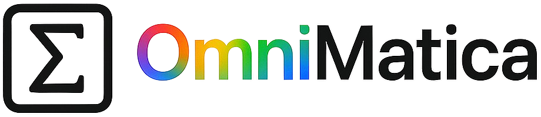

	

  	<strong>Bring math everywhere.</strong>

  	A free and portable Computer Algebra System (CAS) powered by the ESP32 platform. 
  	Designed for symbolic and numerical math — ideal for students, educators, and developers.

  	/<repo>?style=flat-square">
  	/<repo>?style=social">
  	/<repo>?style=social">

---

### 🚀 Features

- Embedded symbolic math engine (CAS)
- Based on ESP32 + C++ + FreeRTOS
- Lightweight display support (LCD / ILI9341)
- Clean matrix input, programmable interface
- Fully open-source and customizable

---

### 🛠️ Tech Stack

- ESP32 (Dual-core MCU with Wi-Fi / BLE)
- Custom CAS interpreter in C++
- LCD / ILI9341 display via SPI
- GitHub Pages for docs

---

### 📚 Use Cases

- Portable math tool for students
- Embedded symbolic calculator
- Open platform for math experiments
- Custom programmable interface

---

### 🧠 Philosophy

OmniMatica is designed to make **advanced math truly portable**.  
Whether you're learning, teaching, or experimenting — math should always be at your fingertips.

> **Bring math everywhere.**

---

### 🤝 Contributing

Pull requests, issues, and forks are welcome.  
If you love math, microcontrollers, and open knowledge — this is for you.

---

### 📄 License
